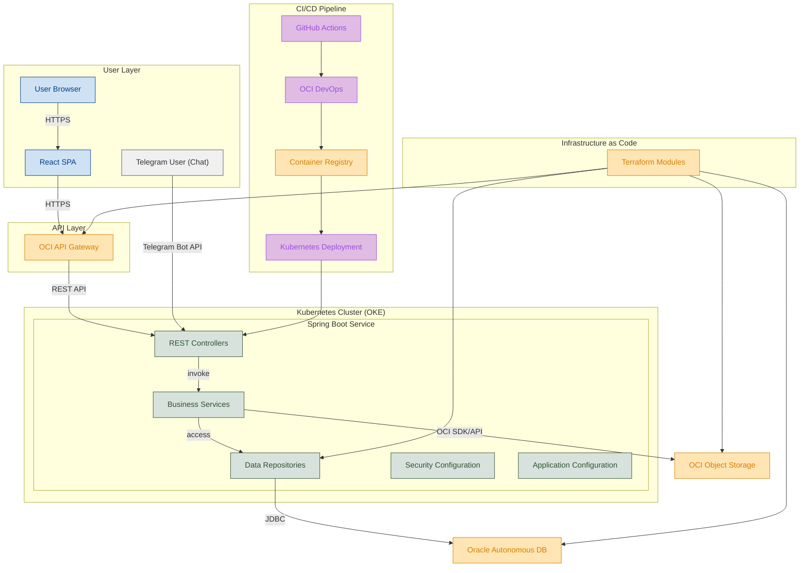

```mermaid
flowchart TD
    %% User Layer
    subgraph "User Layer"
        Browser["User Browser"]:::frontend
        ReactSPA["React SPA"]:::frontend
        TelegramClient["Telegram User (Chat)"]:::external
    end
    Browser -->|"HTTPS"| ReactSPA

    %% API Layer
    subgraph "API Layer"
        APIGateway["OCI API Gateway"]:::infra
    end
    ReactSPA -->|"HTTPS"| APIGateway

    %% Kubernetes Cluster
    subgraph "Kubernetes Cluster (OKE)"
        direction TB
        subgraph "Spring Boot Service"
            Controllers["REST Controllers"]:::compute
            Services["Business Services"]:::compute
            Repositories["Data Repositories"]:::compute
            SecurityConfig["Security Configuration"]:::compute
            AppConfig["Application Configuration"]:::compute
        end
    end
    APIGateway -->|"REST API"| Controllers
    TelegramClient -->|"Telegram Bot API"| Controllers
    Controllers -->|"invoke"| Services
    Services -->|"access"| Repositories
    Repositories -->|"JDBC"| OracleDB["Oracle Autonomous DB"]:::infra
    Services -->|"OCI SDK/API"| ObjStorage["OCI Object Storage"]:::infra

    %% Infrastructure as Code
    subgraph "Infrastructure as Code"
        TerraformModules["Terraform Modules"]:::infra
    end
    TerraformModules --> APIGateway
    TerraformModules --> OracleDB
    TerraformModules --> ObjStorage
    TerraformModules --> Repositories

    %% CI/CD Pipeline
    subgraph "CI/CD Pipeline"
        direction TB
        GitHubActions["GitHub Actions"]:::devops
        OCIDevOps["OCI DevOps"]:::devops
        ContainerRegistry["Container Registry"]:::infra
        K8sDeploy["Kubernetes Deployment"]:::devops
    end
    GitHubActions --> OCIDevOps
    OCIDevOps --> ContainerRegistry
    ContainerRegistry --> K8sDeploy
    K8sDeploy --> Controllers

    %% Click Events
    click ReactSPA "https://github.com/gusortepz/shaken-oci/tree/main/MtdrSpring/backend/src/main/frontend"
    click Controllers "https://github.com/gusortepz/shaken-oci/tree/main/MtdrSpring/backend/src/main/java/com/springboot/MyTodoList/controller"
    click Services "https://github.com/gusortepz/shaken-oci/tree/main/MtdrSpring/backend/src/main/java/com/springboot/MyTodoList/service"
    click Repositories "https://github.com/gusortepz/shaken-oci/tree/main/MtdrSpring/backend/src/main/java/com/springboot/MyTodoList/repository"
    click SecurityConfig "https://github.com/gusortepz/shaken-oci/tree/main/MtdrSpring/backend/src/main/java/com/springboot/MyTodoList/security"
    click AppConfig "https://github.com/gusortepz/shaken-oci/tree/main/MtdrSpring/backend/src/main/java/com/springboot/MyTodoList/config"
    click TerraformModules "https://github.com/gusortepz/shaken-oci/tree/main/MtdrSpring/terraform"
    click APIGateway "https://github.com/gusortepz/shaken-oci/blob/main/MtdrSpring/terraform/apigateway.tf"
    click OracleDB "https://github.com/gusortepz/shaken-oci/blob/main/MtdrSpring/terraform/database.tf"
    click ObjStorage "https://github.com/gusortepz/shaken-oci/blob/main/MtdrSpring/terraform/object_storage.tf"

    %% Styles
    classDef frontend fill:#CFE2F3,stroke:#023E8A,color:#023E8A;
    classDef compute fill:#D8E2DC,stroke:#2F5233,color:#2F5233;
    classDef infra fill:#FFE5B4,stroke:#D67E00,color:#D67E00;
    classDef devops fill:#E0BBE4,stroke:#9D4EDD,color:#9D4EDD;
    classDef external fill:#F0F0F0,stroke:#555,color:#333;

```